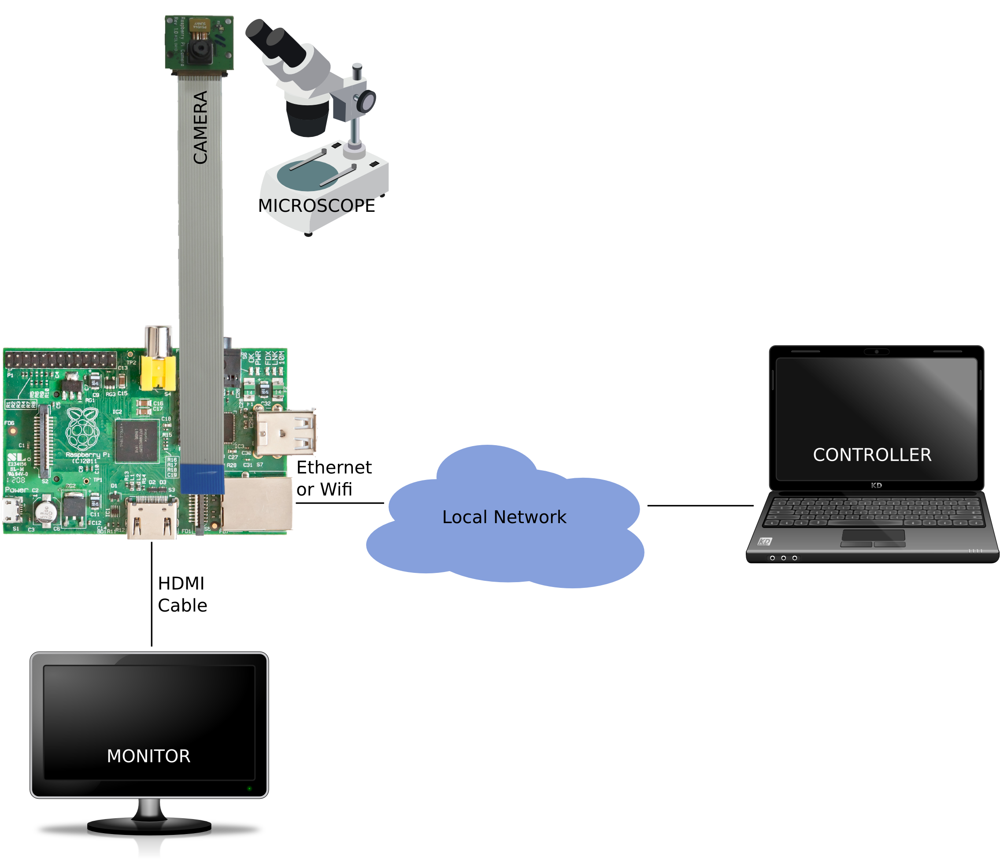

.. _quickstart:

===========
Quick Start
===========

A typical Picroscopy setup is illustrated in the image below:

The Raspberry Pi's camera is attached to the microscope. The exact manner in
which the camera is mounted is left as an exercise for the reader. Simply
taping the camera onto the eye-piece with electrical tape is usually sufficient
for testing, but better results are generally obtained when the camera is held
slightly away from the eye-piece.

The Raspberry Pi's HDMI port is connected to a monitor or TV to display the
live feed from the camera (to allow for positioning and focusing of samples).
The Raspberry Pi is connected to the network via the Ethernet port (or wifi
if you have a compatible USB wifi dongle).

Finally, a second machine (or phone/tablet with web-browser) is used as the
controller.

When Picroscopy is started, it should automatically start a video preview on
the screen attached to the Pi. On a machine connected to the same network as
the Pi, open a web browser and browse to the address and port that Picroscopy
is listening on, e.g. ``http://mypi.example.com:8000/``.

  .. note:: Picroscopy listens on port 80 by default when it is run by
    ``root``, or on port 8000 when it is run by a non-root user.

The default page is the :ref:`library` which displays the images taken by
Picroscopy. Click on the *Settings* button and enter your name in the box at
the top of the page, then click on *Apply* to return to the Library page.

  .. note:: By default, Picroscopy requires a name before it will
    capture images (the name, and other settings like copyright are added to the
    EXIF tags of captured images).

Click on the *Capture* button to capture the image currently display on the
screen. The page should refresh and show a thumbnail of the captured image. At
this point, the *Download* button should be enabled. Clicking on this button
will download all captured images as a ``.zip`` archive.

If you entered your e-mail address on the :ref:`settings`, the *Send*
button should also be enabled. Clicking on this button will send an e-mail to
your address with all captured images as attachments.

Finally, the *Logout* button will also be enabled. Clicking on this button will
clear the Library of all captured images, and reset all fields on the
:ref:`settings` to their default values, ready for the next user.

